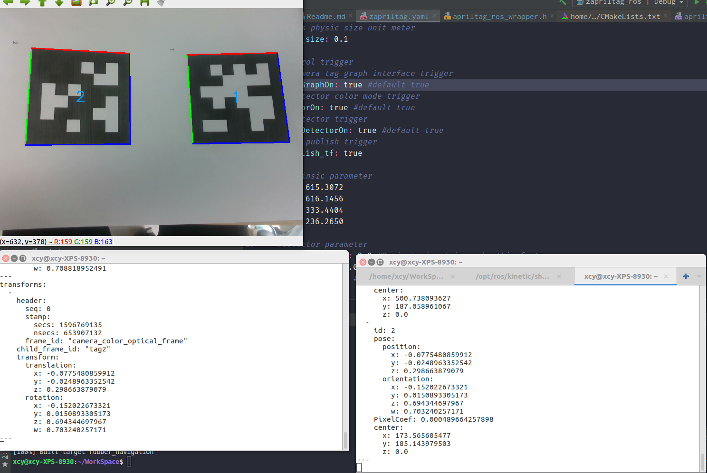

## zapriltag_ros

​	This package provides the zapriltag_ros node which detect april tag and provide the 6 DOF pose estimation. The detection can be stopped at any time.



### Compile & Dependency&Usage

​	This package depend on [apriltag](https://github.com/AprilRobotics/apriltag), OpenCV.  After apriltag and OpenCV were installed, clone this repositery and compile it by catkin_make.

-  install apriltag by cmake

  ```
  git clone https://github.com/AprilRobotics/apriltag.git
  cd apriltag
  cmake .
  sudo make install
  cd ..
  sudo rm -rf apriltag
  ```

- Usage

  ```
  roslaunch zapriltag_ros zapriltag_ros.launch
  ```

### Subscribe Topics

​	Currently, this package only subscribe 

​	`/camera/color/image_raw (sensor_msgs/Image)`

### Publish Topics

​	The pose estimation results is published as a custom msg (see `msg/TagDetecion_msg.msg`)

​	`TagsDetected (zapriltag_ros/TagDetection_msg.msg)`

### Parameters

​	The parameters used are stored at the `config/zapriltag.yaml`. Check for further information.

- ~intrinsic parameter

  intrinsic parameter contains `fx`,`fy`,`u0`,`v0`

- ~quad_decimate

  Decimate input image by this factor.

- ~quad_sigma

  Apply low-pass blur to input; negative sharpens

- ~nthreads

  Use this many CPU threads

- ~refine_edges

  True for spending more time trying to align edges of tags

- ~tag_family_name:

  Name of tag family to use. Options have tag36h11, tag16h5,tagCircle21h7,tagCircle49h12,tagStandard41h12,tagStandard52h13,tagCustom48h12

- ~tag_size

  The physic size of tag, unite: meter

- ~tagDetectorOn/tagGraphOn/colorOn

  Use at any time by `ros::param::set("zapriltag_ros/tagDetectorOn",false)`to activate or stop detection/detection result display/image display.

### Tips

 	If the `TagDetection_msg` is need at other package. Modify your CmakeList and package.xml to add

```
find_package(catkin REQUIRED COMPONENTS
  zapriltag_ros
)

#in case of could not find zapriltag_ros/TagDetecion_msg.h error
add_dependencies(*** zapriltag_ros_gencpp) 
```

```
<build_depend>zapriltag_ros</build_depend>
<run_depend>zapriltag_ros</run_depend>
```

